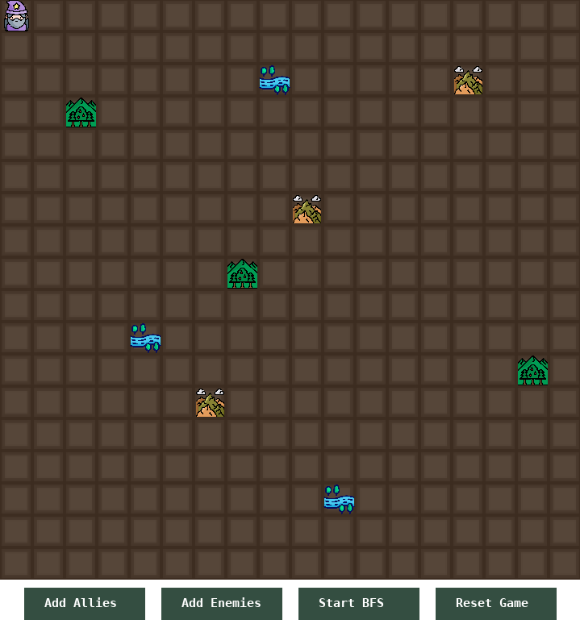
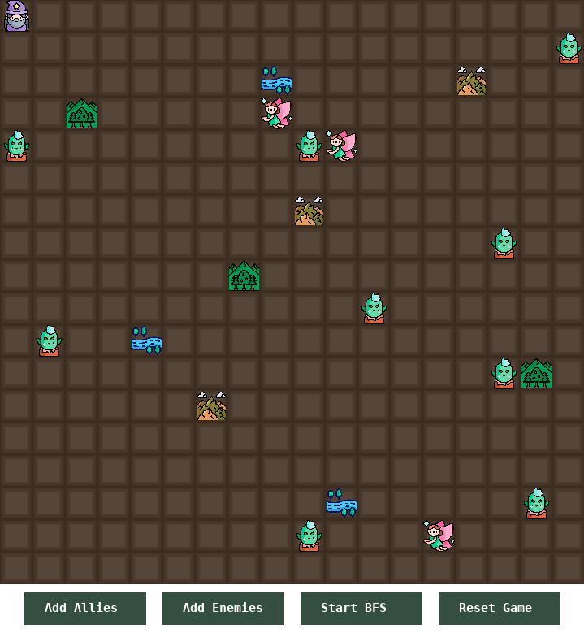
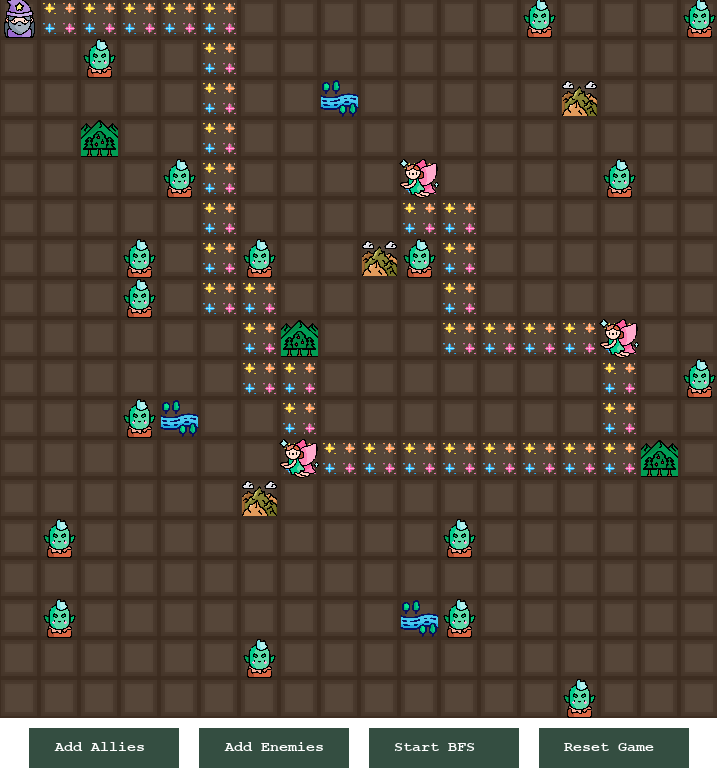

# Grafos1_Salvacao-do-mago

**Número da Lista**: 3<br>
**Conteúdo da Disciplina**: Grafos1<br>

## Alunos
|Matrícula | Aluno |
| -- | -- |
| 22/2037648  |  André Cláudio Maia da Cunha |
| 21/1062713  |  Paola Rebeca Lima do Nascimento |

## Sobre 
Este projeto implementa um algoritmo de busca em um mapa bidimensional onde um mago precisa entregar poções de regeneração de vida para seus aliados, enquanto desvia de inimigos posicionados no mapa. O objetivo é calcular e fornecer o menor caminho possível que passe pelos aliados sem atravessar os territórios dos inimigos, facilitando o trabalho do mago.<br>
O projeto utiliza um algoritmo de busca em largura (BFS - Breadth-First-Search) para explorar o mapa e encontrar o menor caminho. O algoritmo é adaptado para evitar os pontos marcados como inimigos e garantir que o mago passe pelos três aliados na ordem mais eficiente.

## Screenshots




## Instalação 
**Linguagem**: Python 3<br>
**Framework**: Pygame<br>
#### 1. Crie o ambiente virtual:
```bash
python3 -m venv venv
```

#### 2. Ative o ambiente virtual:
- No Linux/MacOS:
```bash
source venv/bin/activate
```
- No Windows:
```bash
venv\Scripts\activate
```

#### 3. Com o ambiente virtual ativo, instale as dependências:
```bash
pip install -r requirements.txt
```
#### 4. No diretório src execute o programa:
```bash
python3 main.py
```

## Uso 
#### 1. Clique no botão Add Allies para adicionar os aliados;
#### 2. Caso deseje, clique no botão Add Enemies para adicionar os inimigos;
#### 3. Clique no botão Start BFS para ver o caminho sendo desenhado;
#### 4. Clique em Reset Game para poder executar de novo.

## Vídeo
Link: https://www.youtube.com/watch?v=t5slQFQ2mqg


